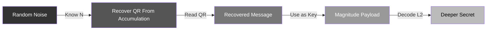
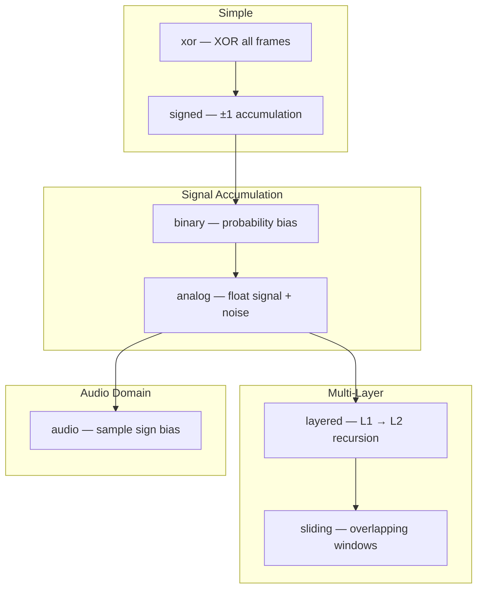
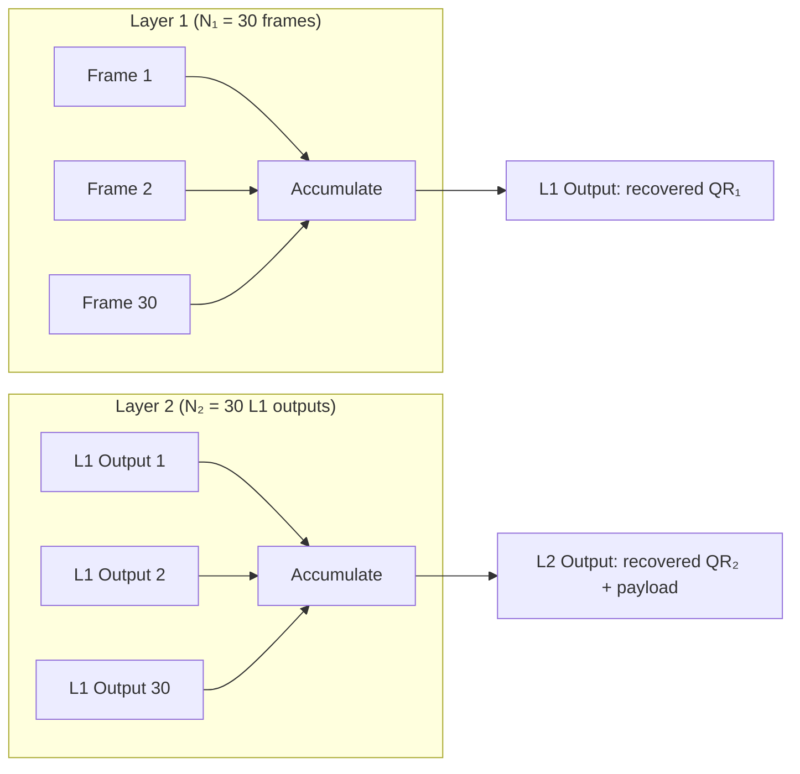
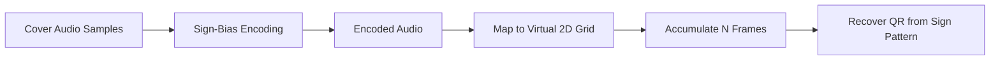
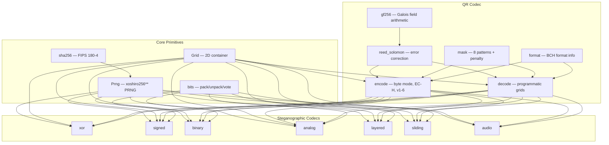

# Experimental Codecs

> This document describes the experimental codec designs that preceded the production `temporal` codec. These codecs informed the final design but do not satisfy the production visual concealment requirement. See [README.md](README.md) for the current project overview and [TEMPORAL.md](TEMPORAL.md) for the production codec design.

Seven hiding strategies, from dead-simple to deeply layered, developed as research experiments in steganographic accumulation.

## Core Concept

Each frame looks like random static. Accumulate N frames and a QR code is revealed in the accumulated field.

Terminology note: "revealed", "recovered", and similar phrases in this README refer to decoder-side accumulation and thresholding. The QR is latent in the carrier sequence; it is not expected to become visibly readable in the raw static stream itself.

```
Frame 1        Frame 2        Frame 3           Frame N
  ▓░▒█▓          ░▓█▒░          █▒░▓▒             ▒░▓█░
  ▒█░▓▒          █▒▓░█          ░▓█▒▓    ...      ▓█▒░▓
  ░▓█▒░          ▒░▓█▓          ▓▒░█▒             █░▓▒█

                         ↓ accumulate N frames ↓

                           ███████████████
                           ██ ▒▒▒▒▒▒▒ ▒██
                           ██ ██████▒ ▒██
                           ██ ██████▒ ▒██    ← QR revealed after accumulation
                           ██ ██████▒ ▒██
                           ██ ▒▒▒▒▒▒▒ ▒██
                           ███████████████
```

N is a secret. Wrong N yields garbage. Right N reveals a decodable QR in the accumulated field — and that message may itself be a key to a deeper layer of steganography hiding in the same data.

## Layered Keys

**N is only the first key.** Knowing N is just the beginning.

```
┌──────────┬───────────────────┬──────────────────────────────────────────┐
│  Layer   │  Key              │  Unlocks                                 │
├──────────┼───────────────────┼──────────────────────────────────────────┤
│  0       │  N (frame count)  │  Ability to accumulate correctly         │
│  1       │  QR content       │  The visible message OR a decryption key │
│  2       │  Magnitude data   │  Payload hidden in "how far" from zero   │
│  3       │  L2 QR content    │  Key to decode deeper payload stream     │
└──────────┴───────────────────┴──────────────────────────────────────────┘
```

Each layer requires the previous layer's key. An attacker who doesn't know N sees noise. One who knows N but not the QR meaning can recover the QR from the accumulated field but still can't decode the magnitude payload. The deeper you go, the more keys you need.



## Signal vs Noise Theory

All accumulation-based codecs rely on signal growing faster than noise:

```
Frames:        1        4       16       64      256
              ───      ───      ───      ───      ───
Signal sum:    S       4S      16S      64S     256S    (linear)
Noise sum:     σ       2σ       4σ       8σ      16σ    (√N)
              ───      ───      ───      ───      ───
SNR:           1        2        4        8       16    (√N improvement)


             │
     Signal  │                                    ****
       or    │                               *****
     Noise   │                          *****
             │                     *****
             │               ******
             │         ******                  ←── Signal (linear)
             │    *****
             │ ***
             │**     ════════════════════════ ←── Noise (√N)
             └────────────────────────────────────────
                              N frames
```

More frames = cleaner accumulated QR signal = more reliable decoding.

## Codec Families

Seven hiding strategies, from dead-simple to deeply layered:

| Codec | Frame Type | Payload? | Key Idea |
|-------|-----------|----------|----------|
| **xor** | `Grid<u8>` | No | XOR all frames to recover QR |
| **signed** | `Grid<i8>` | Yes | ±1 carriers, noise reconstruction |
| **binary** | `Grid<i8>` | Yes | Probability-biased TV snow |
| **analog** | `Grid<f32>` | Yes | Float signal + noise, SNR grows as √N |
| **layered** | `Grid<f32>` | Yes | Recursive L1/L2 steganography |
| **sliding** | `Grid<f32>` | Yes | Overlapping windows, no detectable boundaries |
| **audio** | `Vec<f32>` | No | QR hidden in audio sample sign bias |



---

### 1. XOR — Binary XOR

The simplest approach. Each frame is binary (0 or 1). XOR all frames to recover the QR.

```
                    ENCODING                              DECODING

  QR Target     Random Frames      Final Frame
  ┌───────┐     ┌───────┐         ┌───────┐
  │█░█░█░█│     │░█░█░░█│         │░░█░░█░│
  │░█████░│  +  │█░█░█░░│   →     │█░░░█░░│        XOR all N frames
  │█░█░█░█│     │░░█░░█░│         │█░░░█░█│             ↓
  └───────┘     └───────┘         └───────┘        ┌───────┐
                Frame 1..N-1       Frame N         │█░█░█░█│
                (random)          (computed)       │░█████░│  ← recovered QR grid
                                                   │█░█░█░█│
  Frame N = QR ⊕ Frame₁ ⊕ ... ⊕ Frame_{N-1}        └───────┘
```

**Properties:** Binary frames, any frame order (XOR is commutative), no hidden payload.

```rust
use qrstatic::codec::xor::XorEncoder;
use qrstatic::codec::xor::XorDecoder;

let encoder = XorEncoder::new(8, "seed-42")?;
let frames = encoder.encode_message("Hello, world!")?;

let decoder = XorDecoder;
let result = decoder.decode(&frames)?;
assert_eq!(result.message.as_deref(), Some("Hello, world!"));
# Ok::<(), qrstatic::Error>(())
```

---

### 2. Signed — Signed Accumulation

Frames contain ±1 carrier values. Accumulate them: the sign pattern in the accumulated grid reveals QR modules, while the magnitude encodes payload via expected-noise reconstruction.

```
   Frame 1         Frame 2         Frame N        Accumulated
  ┌─────────┐     ┌─────────┐     ┌─────────┐     ┌─────────┐
  │+1 -1 +1 │     │+1 +1 +1 │     │+1 -1 +1 │     │+N  -3  +N│
  │-1 +1 -1 │  +  │-1 -1 -1 │ ... │-1 +1 -1 │  =  │-N  +5  -N│
  │+1 -1 +1 │     │-1 +1 -1 │     │+1 -1 +1 │     │+3  -N  +N│
  └─────────┘     └─────────┘     └─────────┘     └─────────┘

                    Accumulated sign → QR pattern
                    Magnitude deviation → payload bits
```

**Properties:** Integer arithmetic, deterministic noise cancellation, payload in magnitude residuals.

```rust
use qrstatic::codec::signed::SignedEncoder;
use qrstatic::codec::signed::SignedDecoder;

let encoder = SignedEncoder::new(30, (41, 41), "carrier", 10)?;
let frames = encoder.encode_message("visible-key", b"hidden payload")?;

let decoder = SignedDecoder::new((41, 41), "carrier", 30, 10, "hidden payload".len())?;
let result = decoder.decode_message(&frames)?;
assert_eq!(result.message.as_deref(), Some("visible-key"));
assert_eq!(result.payload.as_deref(), Some(&b"hidden payload"[..]));
# Ok::<(), qrstatic::Error>(())
```

---

### 3. Binary — Binary Static

The most memory-efficient approach. Each frame is pure binary static — just +1 or -1, like real TV snow. Grayscale is recovered from temporal accumulation, not from per-frame values.

```
                         BINARY STATIC

    Single frame (pure +1/-1):       Accumulated over N frames:
    ┌──────────────────────────┐     ┌──────────────────────────┐
    │+1 -1 +1 -1 +1 +1 -1 +1  │     │+24 -18 +32 -28 +36 +20  │
    │-1 +1 -1 -1 +1 -1 +1 -1  │     │-30 +22 -26 -34 +28 -24  │
    │+1 -1 +1 +1 -1 +1 -1 +1  │     │+18 -32 +30 +24 -20 +36  │
    └──────────────────────────┘     └──────────────────────────┘
    Looks like random noise          Accumulated sign carries QR
    (1 value per pixel)              Accumulated magnitude carries payload
```

#### Encoding via Probability Bias

Instead of storing a target value, we bias the probability of +1 vs -1:

```
White QR module:  P(+1) = 0.8    →  accumulated sum trends positive
Black QR module:  P(+1) = 0.2    →  accumulated sum trends negative

After N=60 frames:
  White pixel: expected sum = 60 × (0.8 - 0.2) = +36
  Black pixel: expected sum = 60 × (0.2 - 0.8) = -36

Payload encoded by adjusting bias strength:
  bit=1: stronger bias (0.9)  →  higher magnitude
  bit=0: weaker bias (0.7)    →  lower magnitude
```

**Properties:** 1 bit per pixel per frame, 4x memory reduction vs floats, authentic TV snow appearance.

```rust
use qrstatic::codec::binary::{BinaryEncoder, BinaryDecoder};

let encoder = BinaryEncoder::new(60, (41, 41), "carrier-seed", 0.8, 0.1)?;
let frames = encoder.encode_message("visible-key", b"hidden payload")?;

let decoder = BinaryDecoder::new("hidden payload".len(), 0.8)?;
let result = decoder.decode_message(&frames)?;
assert_eq!(result.message.as_deref(), Some("visible-key"));
assert_eq!(result.payload.as_deref(), Some(&b"hidden payload"[..]));
# Ok::<(), qrstatic::Error>(())
```

---

### 4. Analog — Analog Grayscale

Frames contain continuous float values. Signal accumulates linearly while noise grows as √N, improving SNR with every frame.

```
                         SIGNAL ACCUMULATION

    Frame 1          Frame 2          Frame N         Accumulated
   ┌────────┐       ┌────────┐       ┌────────┐       ┌────────┐
   │+.1 -.1 │       │+.1 -.1 │       │+.1 -.1 │       │+N  -N  │
   │-.1 +.1 │   +   │-.1 +.1 │  ...  │-.1 +.1 │   =   │-N  +N  │
   │+.1 -.1 │       │+.1 -.1 │       │+.1 -.1 │       │+N  -N  │
   └────────┘       └────────┘       └────────┘       └────────┘
    + noise          + noise          + noise         signal >> noise

                    Signal: grows as N
                    Noise:  grows as √N
                    SNR:    improves as √N
```

#### Dual-Channel Encoding

The QR is recovered from the **sign** of accumulated values. But the **magnitude** (how far from zero) encodes additional data:

```
                    DUAL-CHANNEL ENCODING

                      Accumulated Height Field

        Sign yields QR after accumulation:  Magnitude hides payload:

          + + - - + +                   2.1  2.3  1.8  1.9  2.2  2.0
          + - - - - +                   2.0  1.7  2.1  1.8  1.9  2.2
          - - + + - -        →          1.9  2.0  2.4  2.1  1.8  1.7
          - - + + - -                   2.1  1.8  2.0  2.3  2.0  1.9
          + - - - - +                   2.2  1.9  1.7  2.0  1.8  2.1
          + + - - + +                   2.0  2.1  1.9  1.8  2.2  2.0

        Threshold at 0 → QR            Decode with QR key → payload
```

**Properties:** Grayscale frames (natural TV static appearance), QR in sign, payload in magnitude.

```rust
use qrstatic::codec::analog::{AnalogEncoder, AnalogDecoder};

let encoder = AnalogEncoder::new(30, (41, 41), 1.0, 0.3, 0.1)?;
let frames = encoder.encode_message("visible-key", b"hidden payload")?;

let decoder = AnalogDecoder::new((41, 41), "visible-key", 30, "hidden payload".len())?;
let result = decoder.decode_message(&frames)?;
assert_eq!(result.message.as_deref(), Some("visible-key"));
assert_eq!(result.payload.as_deref(), Some(&b"hidden payload"[..]));
# Ok::<(), qrstatic::Error>(())
```

---

### 5. Layered — Two-Layer Recursive

A layered recovery pipeline. Layer 1 accumulated outputs become the "frames" for Layer 2.

```
                         RECURSIVE STRUCTURE

    Carrier Frames (N₁ = 30)              Layer 1 Accumulated Output
    ┌──┬──┬──┬──┬──┬──┬──┬──┐            ┌────────────┐
    │▓▒│░▓│█▒│▒░│▓█│░▒│▓░│...│  accumulate  │            │
    └──┴──┴──┴──┴──┴──┴──┴──┘      →     │   QR₁      │
         30 noise frames                  │            │
                                          └────────────┘

    Layer 1 Accumulated Outputs (N₂ = 30) Layer 2 Output
    ┌────┬────┬────┬────┬────┐           ┌────────────┐
    │QR₁ │QR₁ │QR₁ │QR₁ │... │  accumulate  │            │
    │out₁│out₂│out₃│out₄│    │      →     │ QR₂ + data │
    └────┴────┴────┴────┴────┘           │            │
         30 L1 accumulated outputs        └────────────┘

    Total: 30 × 30 = 900 carrier frames per L2 output
```



#### Four Secrets Required

```
┌────────────┬────────────────────────────────────────────────┐
│  Secret    │  Purpose                                       │
├────────────┼────────────────────────────────────────────────┤
│  N₁        │  Carrier frames per L1 output                  │
│  N₂        │  L1 outputs per L2 output                      │
│  QR₁       │  Validates L1 structure                        │
│  QR₂       │  Key to decode L2 payload                      │
└────────────┴────────────────────────────────────────────────┘
```

**Properties:** Hierarchical steganography, 900+ frames for full decode, nested key requirements.

```rust
use qrstatic::codec::layered::{LayeredConfig, LayeredEncoder, LayeredDecoder};

let config = LayeredConfig::new((41, 41), 30, 30);
let encoder = LayeredEncoder::new(config.clone())?;
let frames = encoder.encode("visible-qr", "hidden-qr", b"deep secret")?;

let decoder = LayeredDecoder::new(config)?;
let result = decoder.decode(&frames, "visible-qr", "deep secret".len())?;
assert_eq!(result.layer1_message.as_deref(), Some("visible-qr"));
assert_eq!(result.layer2_message.as_deref(), Some("hidden-qr"));
assert_eq!(result.payload.as_deref(), Some(&b"deep secret"[..]));
# Ok::<(), qrstatic::Error>(())
```

---

### 6. Sliding — Sliding Window

The most sophisticated approach. Overlapping windows create smooth carrier with no detectable boundaries.

```
                       SLIDING WINDOW (50% overlap)

    Frame index:  0         30         60         90        120
                  │          │          │          │          │
    Window A:     ├──────────────────────┤
                  │◄───── N=60 frames ──►│

    Window B:                ├──────────────────────┤
                             │◄───── N=60 frames ──►│

    Window C:                           ├──────────────────────┤
                                        │◄───── N=60 frames ──►│

    ──────────────────────────────────────────────────────────────────►
                                                                   time

    Window A: frames 0-59      ─┬─ 30 frames overlap (50%)
    Window B: frames 30-89     ─┘─┬─ 30 frames overlap (50%)
    Window C: frames 60-119       ─┘

    Each window recovers the same QR after accumulation.
    Decoder can lock on at ANY frame — no fixed boundaries to detect.
```

#### Why Sliding Windows?

Fixed boundaries create detectable patterns:

```
    FIXED WINDOWS (detectable)          SLIDING WINDOWS (smooth)

    │←── N ──→│←── N ──→│               ════════════════════════
    ▓▓▓▓▓▓▓▓▓▓│░░░░░░░░░░│              Continuous, uniform carrier
              ↑                         No statistical discontinuity
         Boundary creates               Decoder locks on anywhere
         statistical artifact
```

**Properties:** No detectable window boundaries, decode from any frame offset, L1 + L2 independently composable.

```rust
use qrstatic::codec::sliding::{SlidingConfig, SlidingEncoder, SlidingDecoder};

let config = SlidingConfig::new((41, 41), 60, 30, 10);
let encoder = SlidingEncoder::new(config.clone())?;

// L1 only — decode from any offset
let frames = encoder.encode_l1("carrier-qr", 300)?;
let decoder = SlidingDecoder::new(config)?;
let result = decoder.decode_l1_at_offset(&frames, 47)?;
assert_eq!(result.layer1_message.as_deref(), Some("carrier-qr"));

// L1 + L2 with payload
let frames = encoder.encode("carrier-qr", "hidden-qr", b"secret", 300)?;
let result = decoder.decode(&frames, "carrier-qr", "secret".len())?;
assert_eq!(result.layer2_message.as_deref(), Some("hidden-qr"));
# Ok::<(), qrstatic::Error>(())
```

---

### 7. Audio — Audio Steganography

Maps audio samples into virtual 2D frames and recovers QR from accumulated sign bias. The encoded audio sounds identical to the cover; only the statistical distribution of sample signs is shifted.

```
                         AUDIO ENCODING

    Cover Audio Waveform                 Encoded Audio Waveform
    ┌──────────────────────────┐         ┌──────────────────────────┐
    │  ╱╲    ╱╲╱╲   ╱╲        │         │  ╱╲    ╱╲╱╲   ╱╲        │
    │ ╱  ╲  ╱    ╲ ╱  ╲       │    →    │ ╱  ╲  ╱    ╲ ╱  ╲       │
    │╱    ╲╱      ╲    ╲╱╲    │         │╱    ╲╱      ╲    ╲╱╲    │
    └──────────────────────────┘         └──────────────────────────┘
    Random sample signs                  Signs biased toward QR pattern
                                         (sounds the same!)

                    ↓ accumulate N frames of samples ↓

              sample_index % frame_size → virtual (row, col)
              Sign of accumulated value → recovered QR module

                           ███████████████
                           ██ ▒▒▒▒▒▒▒ ▒██
                           ██ ██████▒ ▒██
                           ██ ██████▒ ▒██    ← QR recovered from accumulated audio window
                           ██ ██████▒ ▒██
                           ██ ▒▒▒▒▒▒▒ ▒██
                           ███████████████
```



**Properties:** Works on audio waveforms, imperceptible modification, virtual 2D mapping from 1D samples.

```rust
use qrstatic::codec::audio::{AudioConfig, AudioEncoder, AudioDecoder};

let config = AudioConfig::new(60, 64 * 64, 0.4, "audio-seed");
let mut rng = qrstatic::Prng::from_str_seed("cover");
let cover: Vec<f32> = (0..config.n_frames * config.frame_size)
    .map(|_| rng.next_range(-1.0, 1.0))
    .collect();

let encoded = AudioEncoder::new(config.clone())?.encode_samples(&cover, "audio-key")?;
let decoded = AudioDecoder::new(config)?.decode_samples(&encoded)?;
assert_eq!(decoded.message.as_deref(), Some("audio-key"));
# Ok::<(), qrstatic::Error>(())
```

---

## Quick Start

### Direct QR Encoding

If you only want the QR layer without any steganographic carrier:

```rust
use qrstatic::qr;

let grid = qr::encode::encode("hello from qrstatic")?;
let decoded = qr::decode::decode(&grid)?;
assert_eq!(decoded, "hello from qrstatic");
# Ok::<(), qrstatic::Error>(())
```

### CLI Binary Payload Flow

The repository now includes a `qrstatic` CLI binary in the `qrstatic-cli` crate. The current end-to-end CLI path is the binary static codec:

1. `encode binary` takes a QR key plus either text bytes or file bytes.
2. It generates a deterministic static-frame carrier sequence.
3. It writes a `.qrsb` container containing the binary frames plus the decode metadata.
4. `decode binary` reads that container, recovers the QR key from accumulation, and reconstructs the payload bytes.

Example with a text payload:

```bash
cargo run -p qrstatic-cli -- encode binary \
  --qr-key hello-key \
  --payload-text "Hello World" \
  --out /tmp/hello.qrsb

cargo run -p qrstatic-cli -- decode binary --in /tmp/hello.qrsb
```

Example with a file payload:

```bash
cargo run -p qrstatic-cli -- encode binary \
  --qr-key file-key \
  --payload-file ./secret.bin \
  --out /tmp/secret.qrsb

cargo run -p qrstatic-cli -- decode binary \
  --in /tmp/secret.qrsb \
  --payload-out /tmp/recovered-secret.bin
```

If the payload is valid UTF-8 and `--payload-out` is omitted, decode prints it as text. Otherwise, pass `--payload-out` to write the recovered bytes.

#### Binary CLI Flags

`qrstatic encode binary`
- `--qr-key <key>`: required QR/key string embedded in the recoverable QR layer
- `--payload-text <text>`: use inline text as the payload bytes
- `--payload-file <path>`: use file contents as the payload bytes
- `--out <file>`: required output container path
- `--width <n>`: optional frame width override
- `--height <n>`: optional frame height override
- `--frames <n>`: optional frame-count override
- `--seed <seed>`: optional deterministic seed override
- `--base-bias <f32>`: optional binary carrier bias override
- `--payload-bias-delta <f32>`: optional payload bias delta override
- `--optimize`: search for the smallest viable binary stream settings and write a bit-packed container

`qrstatic decode binary`
- `--in <file>`: required input container path
- `--payload-out <path>`: optional recovered payload output path

#### Default vs Optimized Behavior

By default, `encode binary` errs toward conservative settings:
- `41x41` frames
- `60` frames per decode window
- unpacked frame storage in the `.qrsb` container

With `--optimize`, the CLI currently:
- searches for a smaller viable frame size and frame count
- bit-packs the binary frame cells in the container

For a small payload like `Hello World`, that reduces the container size substantially while leaving the underlying carrier semantics unchanged.

#### Current Capacity Caveat

The current single-window binary codec is not yet a general large-file transport.

Today, one binary encode/decode window has at most `width * height` payload bit positions. In practice that means:
- small payloads such as `Hello World` work
- a large file such as a JPEG will usually not fit in one `41x41` window
- the CLI fails explicitly when the payload exceeds the current one-window capacity

Supporting larger files will require either chunking across multiple windows or a denser payload mapping.

### Installation

```toml
[dependencies]
qrstatic = { git = "https://github.com/ianzepp/qrstatic" }
```

```bash
git clone git@github.com:ianzepp/qrstatic.git
cd qrstatic
cargo test
cargo run -p qrstatic-cli -- help
```

## What's Inside

The core library crate is entirely self-contained — no external dependencies at all:



### Repository Layout

```
Cargo.toml               # Workspace manifest
crates/
  qrstatic/
    Cargo.toml           # Core library crate
    src/
      lib.rs             # Public re-exports
      error.rs           # Error enum, Result alias
      grid.rs            # Grid<T> — 2D container over Vec<T>
      sha256.rs          # Hand-rolled SHA-256 (FIPS 180-4)
      prng.rs            # Xoshiro256** seeded via SHA-256
      bits.rs            # Bit pack/unpack, majority voting
      qr/
        encode.rs        # QR encoder (byte mode, EC-H, v1-6)
        decode.rs        # QR decoder (own output only)
        gf256.rs         # GF(256) field arithmetic
        reed_solomon.rs  # RS encoder/decoder
        mask.rs          # 8 mask patterns + penalty scoring
        format.rs        # Format/version info encoding
      codec/
        xor.rs           # Binary XOR
        signed.rs        # Signed accumulation
        binary.rs        # Probability-biased binary static
        analog.rs        # Analog grayscale + magnitude payload
        layered.rs       # Two-layer recursive (L1/L2)
        sliding.rs       # Sliding window + L2 overlay
        audio.rs         # Audio steganography
    tests/
      codec_*.rs         # Per-codec integration tests
      hygiene.rs         # Build hygiene checks
  qrstatic-cli/
    Cargo.toml           # CLI package
    src/main.rs          # `qrstatic encode` / `qrstatic decode`
```

## Design Constraints

The `qrstatic` library crate is intentionally narrow:

- **Zero dependencies** — not even `rand` or `sha2`. Everything is hand-rolled.
- **No camera/image processing** — no OpenCV, no ffmpeg, no image decoding.
- **Deterministic** — same inputs always produce the same frames. Every codec is fully reproducible.
- **QR decoder is specialized** — optimized for grids produced by this crate, not arbitrary photographed QR codes.
- **Library, not application** — the core crate is a reference implementation for steganographic experiments.

## Project Status

Implementation plan complete through Phase 10 (see [PLAN.md](PLAN.md)).

Validated locally on March 16, 2026:
- `cargo doc --no-deps`
- `cargo build`
- `cargo clippy --all-targets --all-features -- -D warnings`
- `cargo test` — **186 passing functional tests + 6 hygiene tests**

The repository also includes a sibling CLI crate with a working binary payload encode/decode path:
- `qrstatic encode binary`
- `qrstatic decode binary`

## Origin

This crate is a Rust rewrite of [`qr-static-stream`](https://github.com/ianzepp/qr-static-stream), extending the original Python prototype with additional codecs (xor, signed), streaming APIs, and zero external dependencies.

## License

MIT
