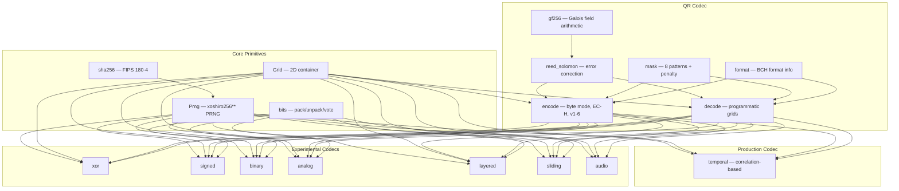

# qrstatic

Zero-dependency Rust crate for steganographic QR codes hidden in temporal noise correlation.

## Core Concept

Each frame looks like random static. Keyed temporal correlation across N frames reveals a hidden QR code. Naive accumulation without the key does not work.

```
Frame 1        Frame 2        Frame 3           Frame N
  ▓░▒█▓          ░▓█▒░          █▒░▓▒             ▒░▓█░
  ▒█░▓▒          █▒▓░█          ░▓█▒▓    ...      ▓█▒░▓
  ░▓█▒░          ▒░▓█▓          ▓▒░█▒             █░▓▒█

            ↓ correlate with correct key ↓        ↓ naive sum (no key) ↓

              ███████████████                       ░▒▓█░▒▓
              ██ ▒▒▒▒▒▒▒ ▒██                       ▓░█▒▓░█
              ██ ██████▒ ▒██                        ▒▓░█▒▓░
              ██ ██████▒ ▒██  ← QR revealed         █▒▓░█▒▓  ← noise only
              ██ ██████▒ ▒██                        ░▓█▒░▓█
              ██ ▒▒▒▒▒▒▒ ▒██                       ▓░▒█▓░▒
              ███████████████                       █▒▓░█▒▓
```

The key insight: the signal lives in keyed temporal correlation, not in the visible per-frame mean image. Without the master key, balanced chip schedules cause the embedded signal to self-cancel under naive accumulation.

## Production Codec: `temporal`

The `temporal` codec is the production steganographic physical layer. All other codecs in this repository are experimental predecessors that informed this design.

### How It Works

**Encoding** — each frame is generated as `noise + signal`, where the signal contribution at each cell is:

```
frame[physical_idx] += l1_amplitude * signal * chip
```

- `signal`: +1/-1 from the QR target map (white = +1, black = -1)
- `chip`: +1/-1 from a balanced temporal schedule (exactly N/2 of each, per cell)
- `physical_idx`: from a per-frame spatial permutation (unique shuffle per frame)

**Decoding** — correlation-based matched filter:

```
field[cell] += unpermuted_sample[cell] * chip[frame][cell]
```

Chips that matched the encoding amplify the signal. Chips that opposed it cancel noise. The correlation field reveals the QR pattern. A detector score gates decode acceptance.

### Key Properties

| Property | Detail |
|----------|--------|
| Frame type | `Grid<f32>` |
| Minimum frames | 4 (must be even for balanced schedules) |
| Chip schedules | Balanced +1/-1 per cell, sum = 0 always |
| Spatial permutation | Unique per frame (not fixed like earlier codecs) |
| Decode method | Keyed matched-filter correlation |
| Detector gating | `detector_score = mean(\|field\|)`, explicit threshold policy |
| Progressive decode | `correlate_prefix` enables lock-on with partial windows |
| Naive resistance | Balanced schedules cause signal self-cancellation without key |
| Key derivation | Domain-separated, versioned, deterministic from master key |

### Signal Model

```
L1(x, y) = sum over t of frame_t(x, y) * c1_t(x, y)
```

Where `c1_t(x, y)` is the balanced temporal code for position `(x, y)` at frame `t`, deterministic from key material. After correlation, threshold into a QR grid and decode.

## Research Basis

The `temporal` codec is grounded in three established bodies of work:

- **Direct-sequence spread spectrum (DSSS)**: acquisition is a correlation-and-threshold problem. The codec uses balanced pseudorandom chip schedules and matched-filter detection, directly following DSSS receiver design. (Stojanovic et al., "Code acquisition for DS/SS communications")
- **Spread-spectrum watermarking**: the carrier is treated as host media carrying many weak hidden contributions that only become strong under the correct detector. Success is judged by detector separation between correct and incorrect keys. (Cox et al., "Secure spread spectrum watermarking for multimedia")
- **Reed-Solomon FEC**: the packet layer (Stage 2, not yet implemented) will reuse standard RS erasure coding rather than inventing bespoke parity logic. (Geisel / NASA JPL, "Tutorial on Reed-Solomon error correction coding")

See [TEMPORAL.md](TEMPORAL.md) for the full production codec design document, including layering model, implementation stages, acceptance criteria, and threat model.

## Quick Start

### Direct QR Encoding

If you only want the QR layer without any steganographic carrier:

```rust
use qrstatic::qr;

let grid = qr::encode::encode("hello from qrstatic")?;
let decoded = qr::decode::decode(&grid)?;
assert_eq!(decoded, "hello from qrstatic");
# Ok::<(), qrstatic::Error>(())
```

### Temporal Codec

```rust
use qrstatic::codec::temporal::*;

// Configure the current Stage 1 baseline profile.
let config = TemporalConfig::new((41, 41), 64, 0.42, 0.22)?;

// Encode
let encoder = TemporalEncoder::new(config.clone())?;
let frames = encoder.encode_message("master-key", "hello from temporal")?;

// Decode
let decoder = TemporalDecoder::new(config)?;
let policy = TemporalDecodePolicy::fixed_threshold(6.0)?;
let result = decoder.decode_qr(&frames, "master-key", &policy)?;
assert_eq!(result.message.as_deref(), Some("hello from temporal"));
# Ok::<(), qrstatic::Error>(())
```

The current working Stage 1 baseline is a later-emerging profile:

- `frames = 64`
- `noise_amplitude = 0.42`
- `l1_amplitude = 0.22`
- `threshold = 6.0`

In the current prefix calibration runs, that profile stays undecodable through `44/64` frames, begins to emerge around `48/64`, and reaches reliable keyed decode by `52/64`.

### CLI

The repository includes a `qrstatic-cli` crate with binary payload encode/decode and a temporal eval runner:

```bash
# Binary codec CLI (experimental)
cargo run -p qrstatic-cli --bin qrstatic -- encode binary \
  --qr-key hello-key \
  --payload-text "Hello World" \
  --out /tmp/hello.qrsb

cargo run -p qrstatic-cli --bin qrstatic -- decode binary --in /tmp/hello.qrsb

# Temporal eval runner
cargo run -p qrstatic-cli --bin qrstatic-temporal-eval

# Prefix acquisition probe for the current baseline
cargo run -p qrstatic-cli --bin qrstatic-temporal-eval -- \
  --trials 128 \
  --prefix-step 4
```

### Installation

```toml
[dependencies]
qrstatic = { git = "https://github.com/ianzepp/qrstatic" }
```

```bash
git clone git@github.com:ianzepp/qrstatic.git
cd qrstatic
cargo test
```

## What's Inside

The core library crate is entirely self-contained — no external dependencies at all:



### Repository Layout

```
Cargo.toml                      # Workspace manifest
TEMPORAL.md                     # Production codec design document
CODECS.md                       # Experimental codec documentation
PLAN.md                         # Historical build plan
crates/
  qrstatic/
    Cargo.toml                  # Core library crate
    src/
      lib.rs                    # Public re-exports
      error.rs                  # Error enum, Result alias
      grid.rs                   # Grid<T> — 2D container over Vec<T>
      sha256.rs                 # Hand-rolled SHA-256 (FIPS 180-4)
      prng.rs                   # Xoshiro256** seeded via SHA-256
      bits.rs                   # Bit pack/unpack, majority voting
      qr/
        encode.rs               # QR encoder (byte mode, EC-H, v1-6)
        decode.rs               # QR decoder (own output only)
        gf256.rs                # GF(256) field arithmetic
        reed_solomon.rs         # RS encoder/decoder
        mask.rs                 # 8 mask patterns + penalty scoring
        format.rs               # Format/version info encoding
      codec/
        temporal.rs             # Production: correlation-based temporal codec
        xor.rs                  # Experimental: binary XOR
        signed.rs               # Experimental: signed accumulation
        binary.rs               # Experimental: probability-biased binary static
        analog.rs               # Experimental: analog grayscale + magnitude payload
        layered.rs              # Experimental: two-layer recursive (L1/L2)
        sliding.rs              # Experimental: sliding window + L2 overlay
        audio.rs                # Experimental: audio steganography
    tests/
      codec_*.rs                # Per-codec integration tests
      hygiene.rs                # Build hygiene checks
  qrstatic-cli/
    Cargo.toml                  # CLI package
    src/
      main.rs                   # qrstatic encode / decode
      temporal_eval.rs          # Temporal codec eval runner
  qrstatic-debug-macos/
    Cargo.toml                  # macOS debug viewer
    src/main.rs                 # Live frame visualization
```

## Experimental Codecs

Seven experimental codecs preceded the production `temporal` codec. They explored the design space from simple XOR accumulation through signed carriers, probability-biased binary static, analog float signal models, recursive two-layer steganography, sliding windows, and audio domain embedding. Each experiment revealed a new vulnerability or limitation that the final temporal design addresses.

Full documentation with code examples, diagrams, and API usage: [CODECS.md](CODECS.md)

## Design Constraints

The `qrstatic` library crate is intentionally narrow:

- **Zero dependencies** — not even `rand` or `sha2`. Everything is hand-rolled.
- **No camera/image processing** — no OpenCV, no ffmpeg, no image decoding.
- **Deterministic** — same inputs always produce the same frames. Every codec is fully reproducible.
- **QR decoder is specialized** — optimized for grids produced by this crate, not arbitrary photographed QR codes.
- **Library, not application** — the core crate is a reference implementation for steganographic experiments.

## Project Status

The `temporal` codec Stage 1 (Layer 1 only) is implemented and under active evaluation:

- Fixed-window keyed correlation decode
- Balanced pseudorandom temporal schedules
- Per-frame spatial permutation
- Detector score reporting and thresholded decode policy
- Debug viewer and CLI eval tooling targeting `temporal`

Not yet implemented: Layer 2 payload packets, packet FEC, blind synchronization, threshold calibration from large empirical sweeps. See [TEMPORAL.md](TEMPORAL.md) for the full implementation roadmap.

## Origin

This crate is a Rust rewrite of [`qr-static-stream`](https://github.com/ianzepp/qr-static-stream), extending the original Python prototype with additional codecs, streaming APIs, and zero external dependencies.

## License

MIT
